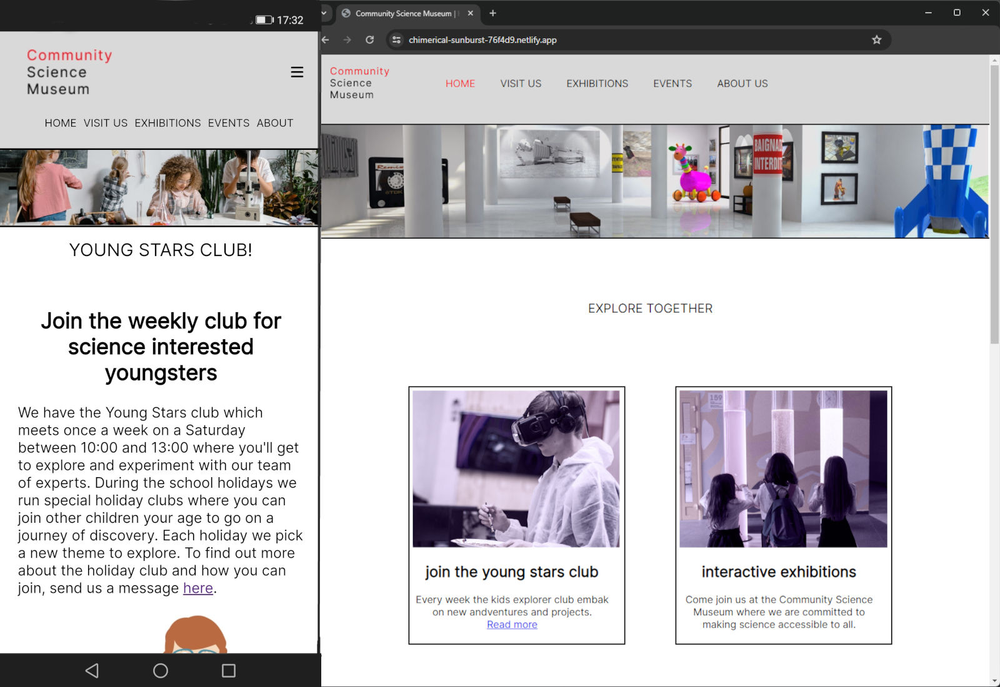

# Community Science Museum



The Community Science Museum is a web-based platform designed to showcase the museums exhibitions and event. It also provides information for visitors and how to get in tough.
The platform is built using HTML and CSS.

## Description

The Community Science Museum project is a straightforward and user-friendly website crafted to offer a seamless experience for visitors to explore the wonders of science, stay informed about ongoing exhibits and events, and access practical information about the museum.

## Built With

- [HTML](https://developer.mozilla.org/en-US/docs/Web/HTML)
- [CSS](https://developer.mozilla.org/en-US/docs/Web/CSS)

## Running

1. Clone the repo:

```bash
git clone https://github.com/Minu321/Semester-Project-1.git
```

2. Open index.html in vs code.

3. Run with live server.

## Contribute

If you'd like to contribute, please follow these guidelines:

1. Fork the repository.
2. Create a new branch for your feature: git checkout -b feature-name
3. Make your changes and commit them: git commit -m 'Add new feature'
4. Push to the branch: git push origin feature-name
5. Open a pull request.

## Contact me

- [LinkedIn](https://www.linkedin.com/in/mina-roseth-beni-652b90292/)
